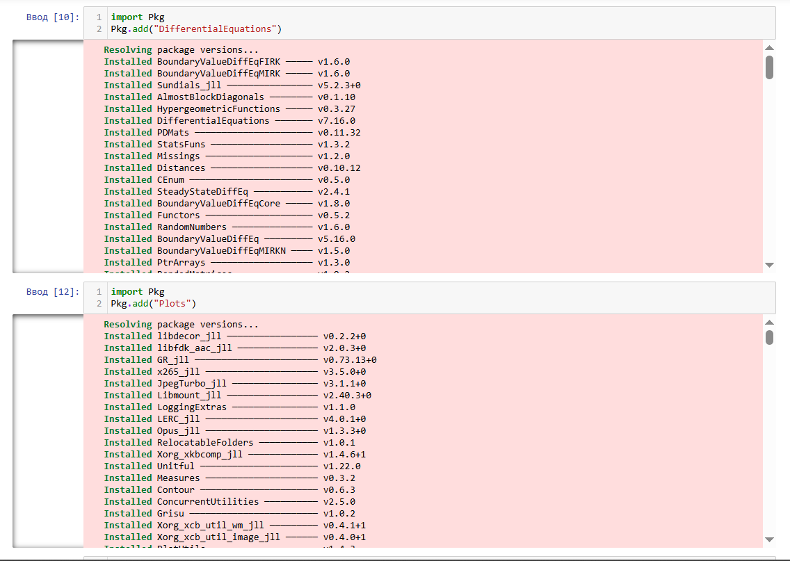
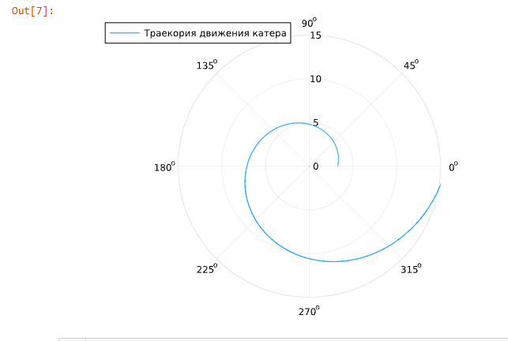
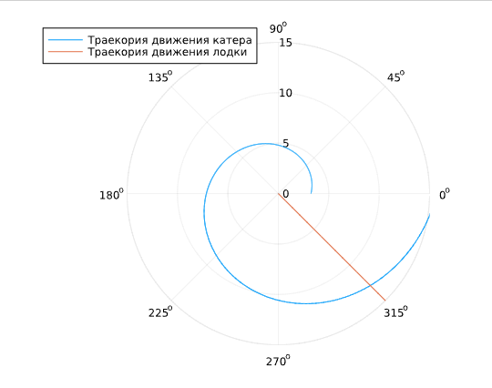
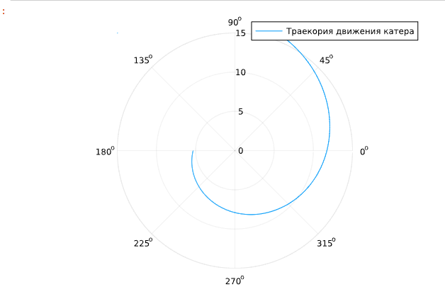
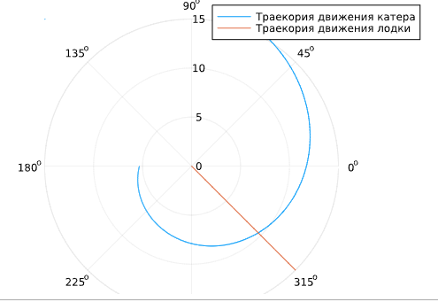

---
## Front matter
lang: ru-RU
title: Лабораторная работа номер 2
subtitle: Задаче о погоне
author:
  - Шуплецов А. А.
institute:
  - Российский университет дружбы народов, Москва, Россия
date: 8 марта 2025

## i18n babel
babel-lang: russian
babel-otherlangs: english

## Formatting pdf
toc: false
toc-title: Содержание
slide_level: 2
aspectratio: 169
section-titles: true
theme: metropolis
header-includes:
 - \metroset{progressbar=frametitle,sectionpage=progressbar,numbering=fraction}
 - '\makeatletter'
 - '\beamer@ignorenonframefalse'
 - '\makeatother'
---

# Информация

## Докладчик

  * Шуплецов Александр Андреевич
  * студент ФФМиЕН
  * Российский университет дружбы народов
  * https://github.com/winnralex

## Цель работы

 Приобретение навыков программирования на языке Julia.

# Выполнение работы

## Импортируем нужные нам для работы библиотеки.

{#fig:001 width=70%}

## Напишем код для решения задачи.

```
using DifferentialEquations, Plots

# расстояние от лодки до катера

k = 16.5

# начальные условия для 1 и 2 случаев

r0 = k/5.1 
r0_2 = k/3.1 
theta0 = (0.0, 2*pi) 
theta0_2 = (-pi, pi)

# данные для движения лодки браконьеров

fi = 3*pi/4;
t = (0, 50);

# функция, описывающая движение лодки браконьеров

x(t) = tan(fi)*t;

# функция, описывающая движение катера береговой охраны

f(r, p, t) = r/sqrt(15.81)

# постановка проблемы и решение ДУ для 1 случая

prob = ODEProblem(f, r0, theta0)

sol = solve(prob, saveat = 0.01)

# отрисовка траектории движения катера

plot(sol.t, sol.u, proj=:polar, lims=(0, 15), label = "Траекория движения катера")

## необходимые действия для построения траектории движения лодки

ugol = [fi for i in range(0,15)]

x_lims = [x(i) for i in range(0,15)]

# отрисовка траектории движения лодки вместе с катером

plot!(ugol, x_lims, proj=:polar, lims=(0, 15), label = "Траекория движения лодки")

# точное решение ДУ, описывающего движение катера береговой охраны

y(x)=(1140*exp(10*x)/(sqrt(1581)))/(509)

# подставим в точное решение угол, под которым движется лодка браконьеров для нахождения точки пересечения

y(fi)

# постановка проблемы и решение ДУ для 2 случая

prob_2 = ODEProblem(f, r0_2, theta0_2)

sol_2 = solve(prob_2, saveat = 0.01)

# отрисовка траектории движения катера

plot(sol_2.t, sol_2.u, proj=:polar, lims=(0,15), label = "Траекория движения катера")


# отрисовка траектории движения лодки вместе с катером

plot!(ugol, x_lims, proj=:polar, lims=(0, 15), label = "Траекория движения лодки")

# точное решение ДУ, описывающего движение катера береговой охраны для 2 случая

y2(x)=(114*exp((10*x/sqrt(1581))+(10*pi/sqrt(1581))))/(31)

# подставим в точное решение угол, под которым движется лодка браконьеров для нахождения точки пересечения

y2(fi-pi)

```

## Получим траекторию движения катера

{#fig:001 width=70%}

## Получим траекторию движения лодки

{#fig:001 width=70%}

## Получим траекторию движения катера второй случай

{#fig:001 width=70%}

## Получим траекторию движения лодки второй случай

{#fig:001 width=70%}

## Выводы

Я приобрел навыки программирования задачи о погоне на языке Julia.

## Список литературы{.unnumbered}

Королькова А. В., Кулябов Д.С. "Материалы к лабораторным работам"
