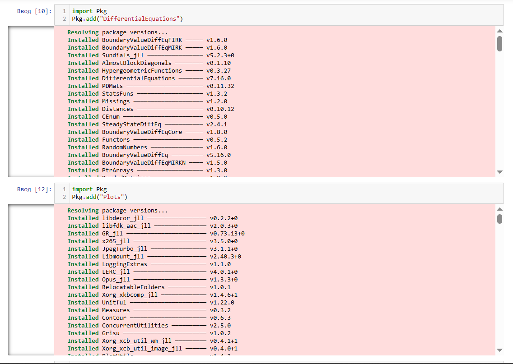
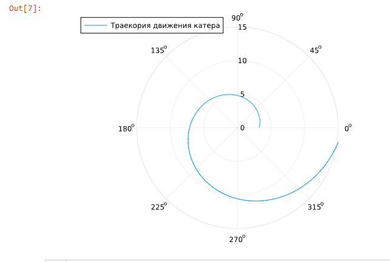
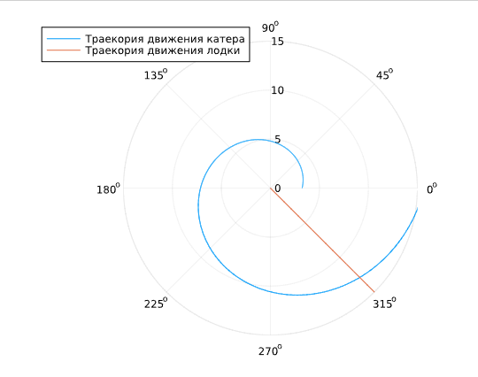
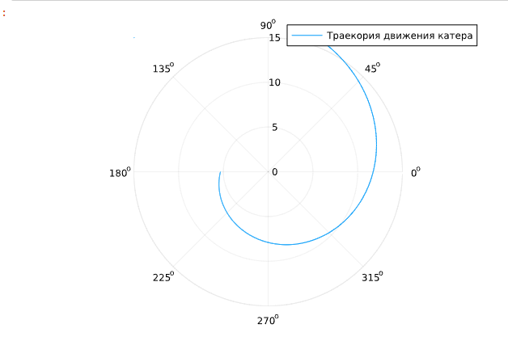
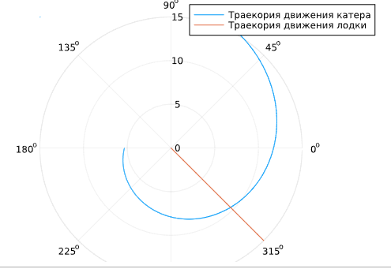

---
## Front matter
title: "Лабораторная работа №2."
subtitle: "Задание о погоне"
author: "Александр Андреевич Шуплецов"

## Generic otions
lang: ru-RU
toc-title: "Содержание"

## Bibliography
bibliography: bib/cite.bib
csl: pandoc/csl/gost-r-7-0-5-2008-numeric.csl

## Pdf output format
toc: true # Table of contents
toc-depth: 2
lof: true # List of figures
lot: true # List of tables
fontsize: 12pt
linestretch: 1.5
papersize: a4
documentclass: scrreprt
## I18n polyglossia
polyglossia-lang:
  name: russian
  options:
	- spelling=modern
	- babelshorthands=true
polyglossia-otherlangs:
  name: english
## I18n babel
babel-lang: russian
babel-otherlangs: english
## Fonts
mainfont: PT Serif
romanfont: PT Serif
sansfont: PT Sans
monofont: PT Mono
mainfontoptions: Ligatures=TeX
romanfontoptions: Ligatures=TeX
sansfontoptions: Ligatures=TeX,Scale=MatchLowercase
monofontoptions: Scale=MatchLowercase,Scale=0.9
## Biblatex
biblatex: true
biblio-style: "gost-numeric"
biblatexoptions:
  - parentracker=true
  - backend=biber
  - hyperref=auto
  - language=auto
  - autolang=other*
  - citestyle=gost-numeric
## Pandoc-crossref LaTeX customization
figureTitle: "Рис."
tableTitle: "Таблица"
listingTitle: "Листинг"
lofTitle: "Список иллюстраций"
lotTitle: "Список таблиц"
lolTitle: "Листинги"
## Misc options
indent: true
header-includes:
  - \usepackage{indentfirst}
  - \usepackage{float} # keep figures where there are in the text
  - \floatplacement{figure}{H} # keep figures where there are in the text
---

# Цель работы

 Приобретение навыков программирования на языке Julia.

# Выполнение работы

1. Импортируем нужные нам для работы библиотеки.

{#fig:001 width=70%}

2. Напишем код для решения задачи.

```
using DifferentialEquations, Plots

# расстояние от лодки до катера

k = 16.5

# начальные условия для 1 и 2 случаев

r0 = k/5.1 
r0_2 = k/3.1 
theta0 = (0.0, 2*pi) 
theta0_2 = (-pi, pi)

# данные для движения лодки браконьеров

fi = 3*pi/4;
t = (0, 50);

# функция, описывающая движение лодки браконьеров

x(t) = tan(fi)*t;

# функция, описывающая движение катера береговой охраны

f(r, p, t) = r/sqrt(15.81)

# постановка проблемы и решение ДУ для 1 случая

prob = ODEProblem(f, r0, theta0)

sol = solve(prob, saveat = 0.01)

# отрисовка траектории движения катера

plot(sol.t, sol.u, proj=:polar, lims=(0, 15), label = "Траекория движения катера")

## необходимые действия для построения траектории движения лодки

ugol = [fi for i in range(0,15)]

x_lims = [x(i) for i in range(0,15)]

# отрисовка траектории движения лодки вместе с катером

plot!(ugol, x_lims, proj=:polar, lims=(0, 15), label = "Траекория движения лодки")

# точное решение ДУ, описывающего движение катера береговой охраны

y(x)=(1140*exp(10*x)/(sqrt(1581)))/(509)

# подставим в точное решение угол, под которым движется лодка браконьеров для нахождения точки пересечения

y(fi)

# постановка проблемы и решение ДУ для 2 случая

prob_2 = ODEProblem(f, r0_2, theta0_2)

sol_2 = solve(prob_2, saveat = 0.01)

# отрисовка траектории движения катера

plot(sol_2.t, sol_2.u, proj=:polar, lims=(0,15), label = "Траекория движения катера")


# отрисовка траектории движения лодки вместе с катером

plot!(ugol, x_lims, proj=:polar, lims=(0, 15), label = "Траекория движения лодки")

# точное решение ДУ, описывающего движение катера береговой охраны для 2 случая

y2(x)=(114*exp((10*x/sqrt(1581))+(10*pi/sqrt(1581))))/(31)

# подставим в точное решение угол, под которым движется лодка браконьеров для нахождения точки пересечения

y2(fi-pi)

```

3. Получим траекторию движения катера

{#fig:001 width=70%}

4. Получим траекторию движения лодки

{#fig:001 width=70%}

5. Получим траекторию движения катера второй случай

{#fig:001 width=70%}

6. Получим траекторию движения лодки второй случай

{#fig:001 width=70%}

# Выводы

Я приобрел навыки программирования задачи о погоне на языке Julia.

# Список литературы{.unnumbered}

Королькова А. В., Кулябов Д.С. "Материалы к лабораторным работам"
