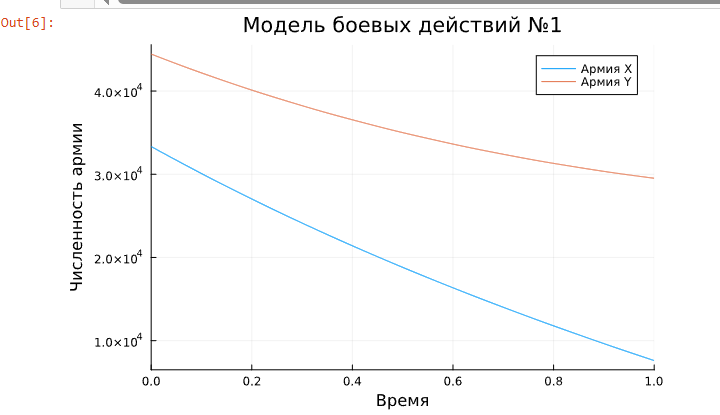
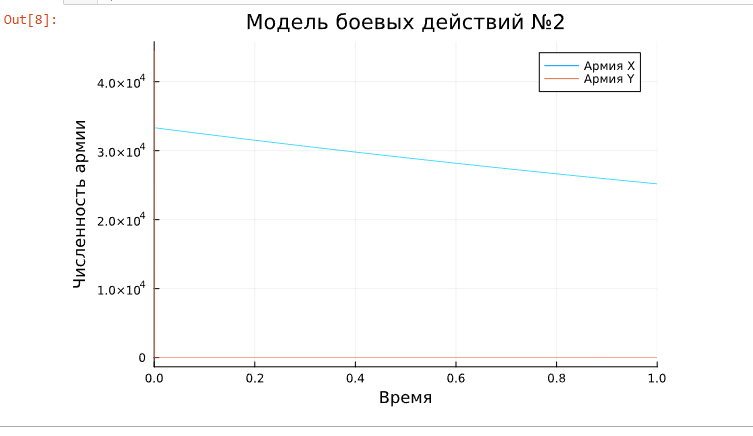

---
## Front matter
lang: ru-RU
title: Лабораторная работа №3
subtitle: Модель боевых действий
author:
  - Шуплецов А. А.
institute:
  - Российский университет дружбы народов, Москва, Россия
date: 22 марта 2025

## i18n babel
babel-lang: russian
babel-otherlangs: english

## Formatting pdf
toc: false
toc-title: Содержание
slide_level: 2
aspectratio: 169
section-titles: true
theme: metropolis
header-includes:
 - \metroset{progressbar=frametitle,sectionpage=progressbar,numbering=fraction}
 - '\makeatletter'
 - '\beamer@ignorenonframefalse'
 - '\makeatother'
---

# Информация

## Докладчик

  * Шуплецов Александр Андреевич
  * студент ФФМиЕН
  * Российский университет дружбы народов
  * https://github.com/winnralex

## Цель работы

 Приобретение навыков программирования на языке Julia и реализация математической модели боевых действий.

## Выполнение работы

## Напишем код для реализации модели боевых действий между регулярными войсками.

```
# используемые библиотеки
using DifferentialEquations, Plots;

# задание системы дифференциальных уравнений, описывающих модель 
# боевых действий между регулярными войсками
function reg(u, p, t)
    x, y = u
    a, b, c, h = p
    dx = -a*x - b*y+abs(sin(t+15))
    dy = -c*x -h*y+abs(cos(t+25))
    return [dx, dy]
end

# начальные условия
u0 = [33333, 44444]
p = [0.15, 0.64, 0.55, 0.12]
tspan = (0,1)

# постановка проблемы
prob = ODEProblem(reg, u0, tspan, p)

# решение системы ДУ
sol = solve(prob, Tsit5())

# построение графика, который описывает изменение численности армий
plot(sol, title = "Модель боевых действий №1",  label = ["Армия X" "Армия Y"], xaxis = "Время", yaxis = "Численность армии")

```

## Проанализируем вывод кода.

{#fig:001 width=70%}

## Напишем код для реализации модели боевых действий между регулярными войсками с участием партизанских отрядов.

```
function reg_part(u, p, t)
    x, y = u
    a, b, c, h = p
    dx = -a*x - b*y+abs(2*sin(3*t))
    dy = -c*x*y -h*y+abs(1.5*cos(2*t))
    return [dx, dy]
end

# начальные условия
u0 = [33333, 44444]
p = [0.28, 0.745, 0.613, 0.35]
tspan = (0.0, 1.0)

# постановка проблемы
prob2 = ODEProblem(reg_part, u0, tspan, p)

# решение системы ДУ
sol2 = solve(prob2, Tsit5())

# построение графика, который описывает изменение численности армий
plot(sol2, title = "Модель боевых действий №2", label = ["Армия X" "Армия Y"], xaxis = "Время", yaxis = "Численность армии")

```

## Проанализируем график модели боевых действий между регулярными войсками с участием партизанских отрядов.

{#fig:001 width=70%}

## Выводы

Я приобрел навыки программирования на языке Julia и реализовал математическую модель боевых действий.

## Список литературы{.unnumbered}

Королькова А. В., Кулябов Д.С. "Материалы к лабораторным работам"
